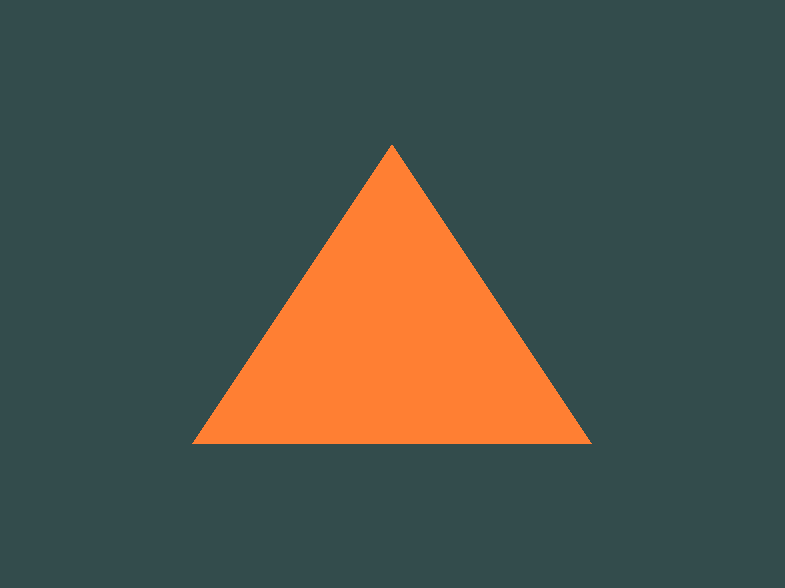
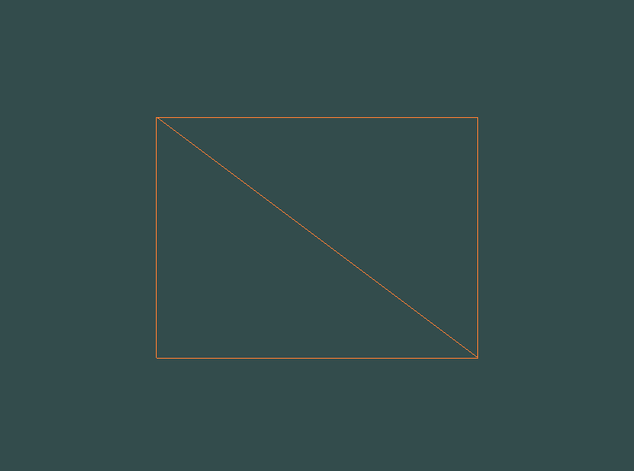
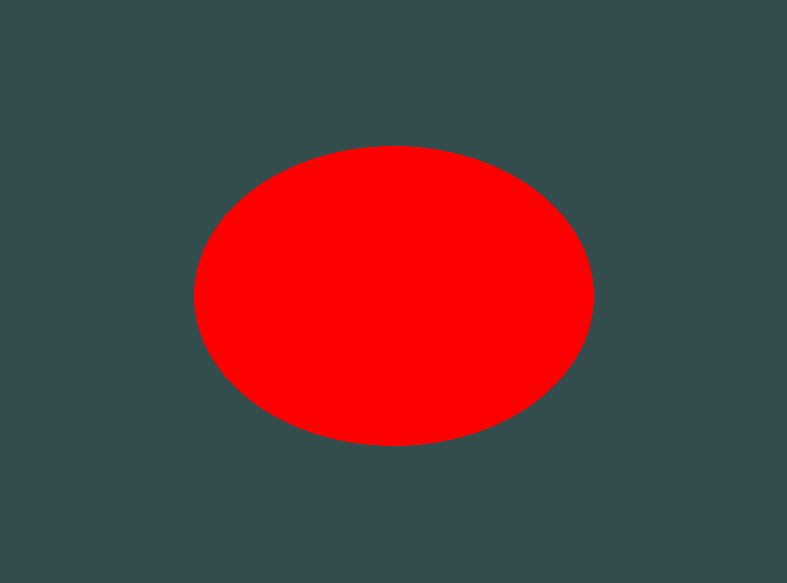

# OpenGL App

A simple C++ OpenGL application that demonstrates rendering a triangle, square, or circle using modern OpenGL (3.3 Core Profile) with GLFW and GLAD. The app allows toggling between solid and wireframe rendering modes, switching between shapes, adjusting the circle's smoothness, and cycling shape colors using keyboard input.

## Features

- Renders a colored triangle, square, or circle in a window.
- Toggle between triangle, square, and circle with the `Space` key.
- Adjust the number of triangles used to approximate the circle with `+` and `-` keys.
- Cycle shape color between red, green, and blue with the `C` key.
- Toggle wireframe/solid mode with the `W` key.
- Clean, minimal code using modern OpenGL practices.

## Screenshots

   
   
   
   

## Controls

| Key      | Action                                                      |
|----------|-------------------------------------------------------------|
| Space    | Toggle between triangle, square, and circle                 |
| Q        | Toggle wireframe/solid mode                                 |
| Escape   | Exit the application                                        |
| C		   | render a cube	                                             |

## Requirements

- C++14 compatible compiler
- [GLFW](https://www.glfw.org/) (window/context/input)
- [GLAD](https://glad.dav1d.de/) (OpenGL function loader)
- OpenGL 3.3 capable GPU and drivers

## Building

1. **Clone the repository:**

